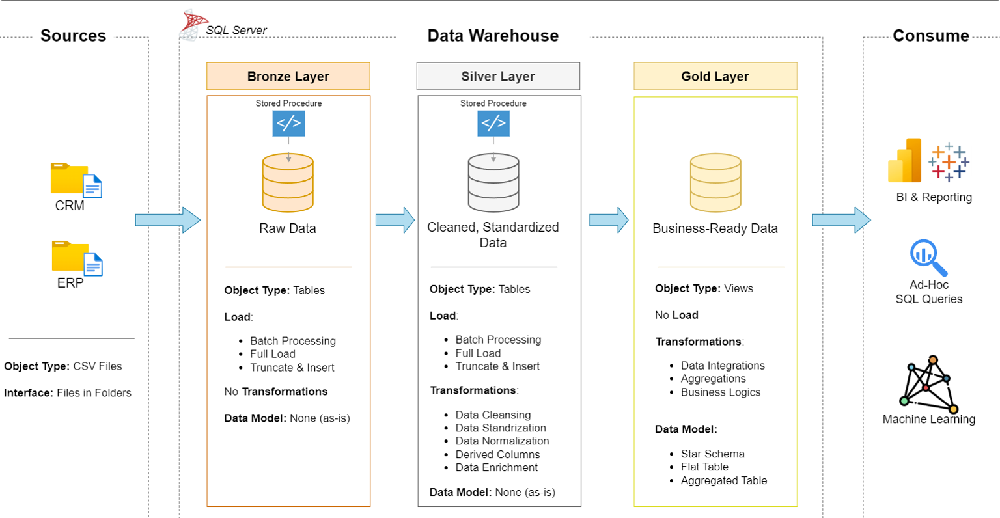

# 🧠 Data Warehouse and Analytics Project

Welcome to the **Data Warehouse and Analytics Project** repository! 🚀  
This project demonstrates a complete **data warehousing and analytics solution** — from data ingestion and transformation to generating actionable business insights.  
It follows **industry best practices** and serves as a professional **portfolio project** showcasing SQL and data engineering skills.

---

## 🏗️ Data Architecture

The project implements the **Medallion Architecture** with three main layers: **Bronze**, **Silver**, and **Gold**.

1. **Bronze Layer** – Stores raw data as-is from the source systems (CSV files).  
2. **Silver Layer** – Cleansed, standardized, and normalized data ready for analysis.  
3. **Gold Layer** – Business-ready data modeled into a **Star Schema** for reporting and analytics.

---

## 📖 Project Overview

This project covers the entire data lifecycle:

1. **Data Architecture** – Design a modern warehouse following Medallion principles.  
2. **ETL Pipelines** – Extract, transform, and load (ETL) data from source systems into SQL Server.  
3. **Data Modeling** – Develop dimension and fact tables optimized for analytical queries.  
4. **Analytics & Reporting** – Write SQL-based reports to deliver business insights.

🎯 **Key Focus Areas:**
- SQL Development  
- Data Architecture  
- Data Engineering  
- ETL Design  
- Data Modeling  
- Business Analytics  

---

## 🛠️ Tools & Resources

All tools and datasets used in this project are **free** and publicly available:

- **[Datasets](datasets/)** – ERP and CRM CSV datasets.  
- **[SQL Server Express](https://www.microsoft.com/en-us/sql-server/sql-server-downloads)** – Lightweight SQL database engine.  
- **[SSMS (SQL Server Management Studio)](https://learn.microsoft.com/en-us/sql/ssms/download-sql-server-management-studio-ssms?view=sql-server-ver16)** – GUI tool for managing databases.  
- **[GitHub](https://github.com/)** – Version control and collaboration platform.  
- **[Draw.io](https://www.drawio.com/)** – Design tool for architecture and data flow diagrams.  

---

## 🚀 Project Requirements

### 🔹 Data Engineering Phase

**Objective:**  
Build a SQL Server-based data warehouse that consolidates and transforms data from ERP and CRM systems for analysis.

**Specifications:**
- Import data from multiple CSV files.  
- Cleanse and validate data for consistency.  
- Integrate ERP and CRM data into a unified model.  
- Design a **star schema** for efficient analytical queries.  
- Document the data model for both business and technical users.

---

### 🔹 Analytics & Reporting Phase

**Objective:**  
Develop SQL-based insights focused on:
- Customer behavior  
- Product performance  
- Sales trends  

These insights empower stakeholders with key business metrics for strategic decision-making.  
For detailed requirements, see [docs/requirements.md](docs/requirements.md).

---
## 📂 Repository Structure

data-warehouse-project/
│
├── datasets/ # Raw datasets (ERP and CRM)
│
├── docs/ # Documentation and diagrams
│ ├── data_architecture.drawio
│ ├── data_catalog.md
│ ├── data_flow.drawio
│ ├── data_models.drawio
│ ├── naming-conventions.md
│
├── scripts/ # SQL scripts for each layer
│ ├── bronze/ # Raw data loading
│ ├── silver/ # Data cleaning & transformation
│ ├── gold/ # Analytical data models
│
├── tests/ # Data validation and quality checks
│
├── README.md # Project overview (this file)
├── LICENSE # License information
├── .gitignore # Git ignore rules
└── requirements.txt # Dependencies and requirements

---

## 🛡️ License

This project is licensed under the [MIT License](LICENSE).  
You are free to use, modify, and distribute this project with proper attribution.

---

## 🌟 About Me

Hi there! I’m **Abdulrahman** — a data enthusiast passionate about **SQL Development, Data Engineering, and Analytics**.  
Through this project, I focused on applying real-world concepts of **data architecture, transformation, and reporting** using SQL Server.

Let’s connect and grow together 👇  

